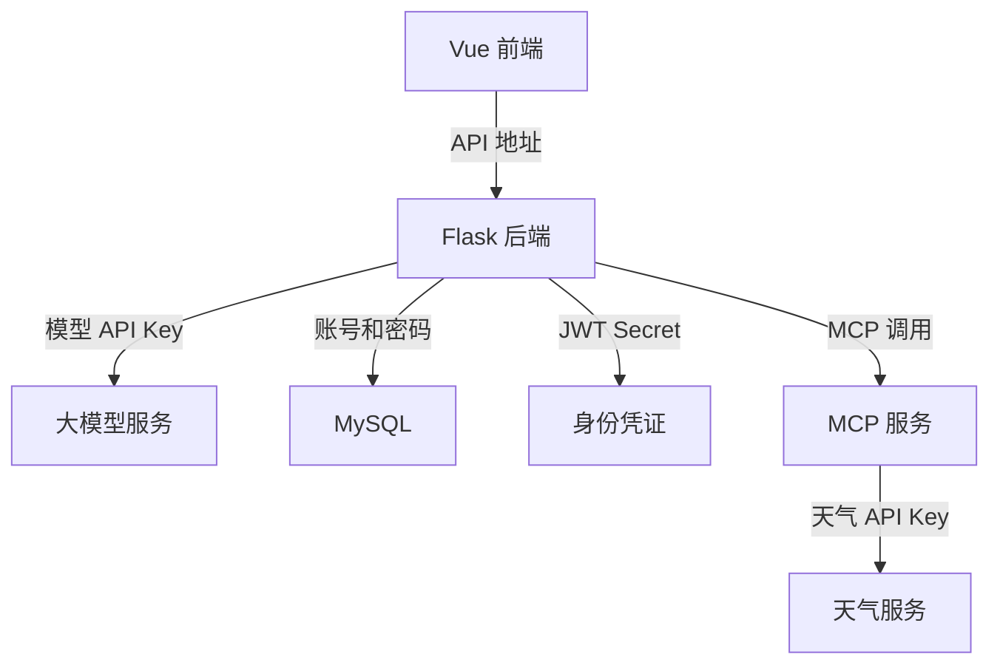
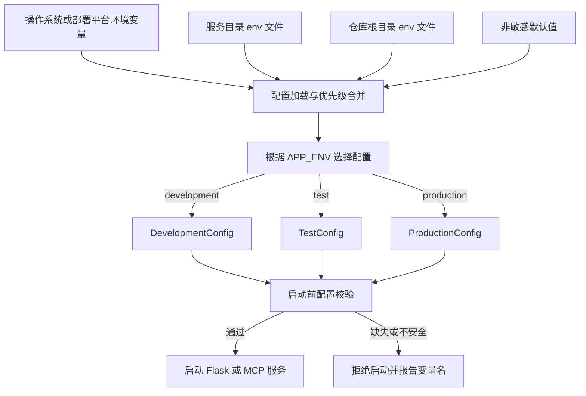
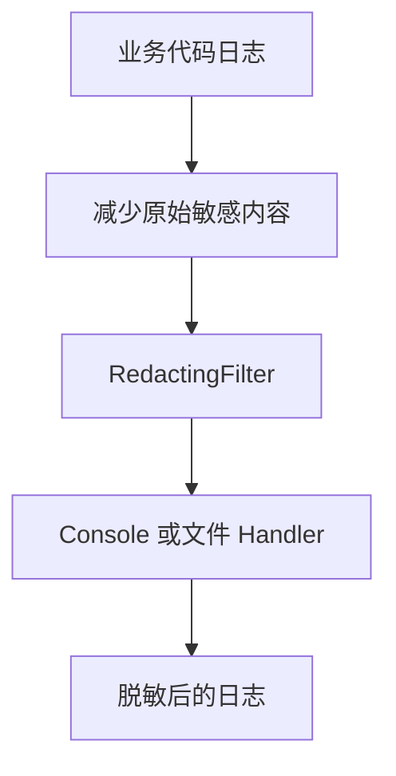
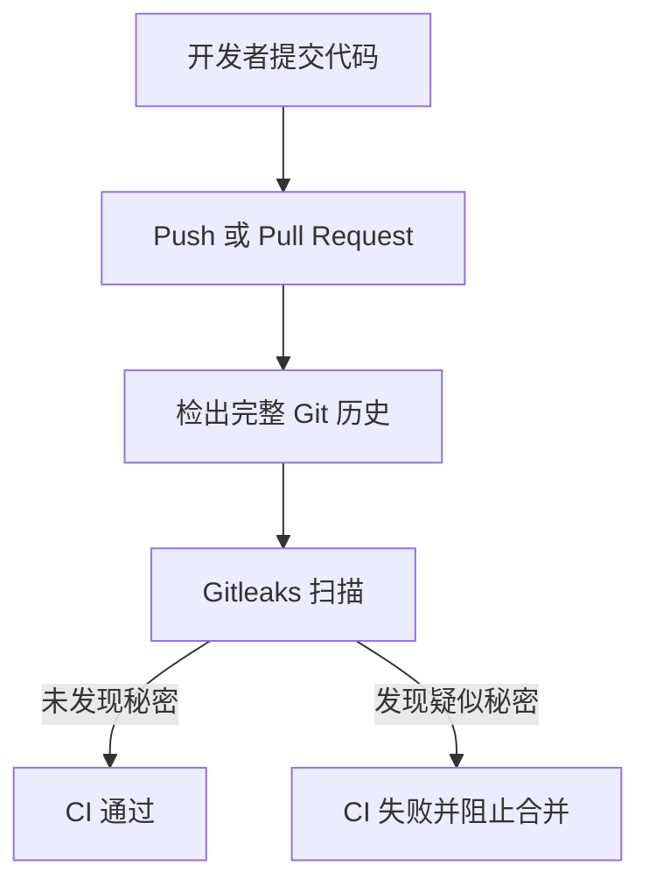
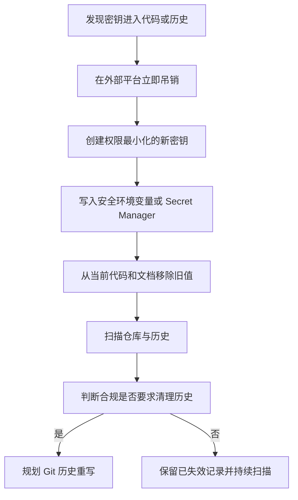

# 阶段 0.1：为 AI Agent 项目建立敏感配置治理与安全基线

一个 AI Agent 项目通常会同时接入大模型、数据库、第三方工具和独立 MCP 服务。随着外部系统越来越多，API Key、数据库密码、JWT Secret 等敏感配置也会迅速分散到不同代码文件中。

在开发早期，把密钥直接写进代码看起来最省事，但这会带来几个长期问题：

- 代码提交后，密钥可能永久留在 Git 历史中。
- 开发、测试和生产环境容易共用同一套凭据。
- 日志可能记录请求头、Token 和完整用户对话。
- 部署时无法安全替换配置，只能修改代码重新构建。
- 某个服务缺少配置时，程序可能带着弱默认值继续运行。

因此，项目升级的第一个阶段不是增加更多业务功能，而是先建立敏感配置治理和运行安全基线。

本阶段的目标可以概括为：

> 真实秘密不进入代码，环境差异不依赖手动改源码，错误配置在启动阶段尽早失败，日志和提交链路提供最后一道泄露防线。

## 一、改造前的主要风险

项目包含三个需要分别治理的运行单元：



如果这些配置直接散落在源代码中，会出现以下风险：

1. 仓库访问者能够直接获得生产凭据。
2. Fork、压缩包、CI 缓存和镜像层都可能复制这些秘密。
3. 即使后来删除代码中的密钥，旧值仍然存在于 Git 历史。
4. 前端环境变量会被打进浏览器产物，错误放入其中的秘密相当于公开。
5. 日志中的 Bearer Token、Cookie 或完整对话可能形成第二条泄露路径。

治理不能只做“把字符串挪到 `.env`”这一个动作，而要覆盖配置加载、启动校验、文件保护、日志、CI 和外部密钥轮换整个生命周期。

## 二、配置治理的整体方案



配置优先级为：

```text
操作系统 / 部署平台环境变量
    > 服务目录 .env
        > 仓库根目录 .env
            > 代码中的非敏感默认值
```

真实密钥不提供代码默认值。代码默认值只用于端口、模型名称、日志级别等不敏感配置。

## 三、后端配置环境化

Flask 后端原本分散的配置被集中到 `app/config.py`，主要包括：

- 大模型 API Key、API Base 和模型名称。
- MySQL 主机、端口、用户名、密码和数据库名。
- JWT Secret。
- 应用监听地址、端口和日志级别。

配置通过统一辅助方法读取：

```python
def _env(name, default=""):
    return os.getenv(name, default).strip()
```

对于端口、超时等整数配置，额外进行类型转换和错误提示：

```python
def _env_int(name, default):
    value = _env(name, str(default))
    try:
        return int(value)
    except ValueError as exc:
        raise RuntimeError(f"{name} must be an integer") from exc
```

这种集中式处理能够避免不同模块各自读取环境变量、默认值不一致和类型错误延迟到运行过程中才暴露。

## 四、Development、Test 与 Production 配置边界

项目使用 `APP_ENV` 选择运行环境：

```env
APP_ENV=development
```

同时兼容常见缩写：

```text
dev      -> development
testing  -> test
prod     -> production
```

三套配置的职责如下：

| 环境 | 主要用途 | Debug | 凭据策略 |
|---|---|---:|---|
| development | 本地开发 | 可开启 | 从本地 `.env` 读取真实开发凭据 |
| test | 自动化测试 | 关闭 | 允许明确标记为 test-only 的隔离值 |
| production | 正式部署 | 强制关闭 | 必须提供真实配置，拒绝示例占位值 |

`APP_ENV` 选择的是配置规则，而 `.env` 提供的是具体配置值。它们不是两套互相独立的配置来源，而是配合工作的：

```text
.env 提供 MYSQL_HOST、JWT_SECRET 等值
                 │
                 ▼
APP_ENV 决定使用 development、test 或 production 规则
                 │
                 ▼
config.py 合并并校验后交给 Flask
```

项目不需要创建 `development.env`、`production.env` 才能完成环境切换。部署平台直接设置 `APP_ENV` 和对应环境变量即可。

## 五、启动阶段快速失败

配置错误越晚发现，排查成本越高。如果直到用户请求到来时才发现数据库密码或模型 Key 缺失，错误位置会远离真正原因。

因此，应用创建阶段会先执行配置校验：

```python
selected_config.validate()
```

缺少必要配置时直接拒绝启动，并只输出缺失的变量名：

```text
Missing required environment variables:
DEEPSEEK_API_KEY, MYSQL_PASSWORD, JWT_SECRET
```

错误信息不会输出变量实际值。

Production 还会拒绝明显的占位内容，例如：

```text
change-me
replace-with
example
test-only
```

这可以防止把 `.env.example` 原样复制到生产环境后，服务仍然使用弱密码或示例密钥运行。

## 六、启动入口安全化

开发服务器原本容易出现两个问题：固定开启 Debug，以及默认监听所有网络接口。

本阶段调整为：

- Debug 由环境配置控制。
- Production 始终关闭 Debug。
- `APP_HOST` 和 `APP_PORT` 支持环境变量。
- 默认监听 `127.0.0.1`，避免本地服务无意暴露到局域网。

示例：

```env
APP_HOST=127.0.0.1
APP_PORT=8123
```

容器部署需要监听所有接口时，再显式配置：

```env
APP_HOST=0.0.0.0
```

显式配置比默认暴露更容易理解，也更符合最小暴露原则。

需要注意，Flask 自带服务器仍然只适合开发。Production 后续应使用 Gunicorn 等 WSGI Server，并在反向代理后运行。

## 七、MCP 服务的独立配置治理

MCP 服务是独立运行进程，不能假设它一定和 Flask 使用同一个工作目录或启动方式，因此建立了独立配置模块。

主要配置包括：

```env
APP_ENV=development
LOG_LEVEL=INFO

SENIVERSE_API_KEY=replace-with-your-weather-api-key

MCP_HOST=127.0.0.1
MCP_PORT=8000
MCP_PATH=/mcp
```

MCP 配置同样支持：

- 服务目录 `.env`。
- 仓库根目录 `.env`。
- 操作系统环境变量优先。
- 缺少天气 API Key 时拒绝启动或调用。
- Production 拒绝示例和测试占位值。
- 校验 MCP 路径必须以 `/` 开头。

这样，天气 API Key 不再出现在 `server.py` 的工具实现中，工具代码只关心业务逻辑。

## 八、`.env.example` 如何既安全又可用

真实 `.env` 不应该提交，但团队成员仍然需要知道项目依赖哪些配置。因此，每个运行单元都提供只包含变量名称和示例格式的模板：

```text
zzx-ai-agent-backend/.env.example
zzx_mcp_server/.env.example
zzx-ai-agent-frontend/.env.example
zzx-ai-agent-frontend/.env.development.example
zzx-ai-agent-frontend/.env.production.example
```

模板中使用明确占位符：

```env
DEEPSEEK_API_KEY=replace-with-your-model-api-key
MYSQL_PASSWORD=replace-with-your-database-password
JWT_SECRET=replace-with-a-long-random-jwt-secret
```

新环境的使用流程是：

```text
复制 .env.example
        │
        ▼
保存为 .env
        │
        ▼
填写当前环境的真实配置
        │
        ▼
设置 APP_ENV
        │
        ▼
启动并通过配置校验
```

`.env.example` 是配置契约，不是可直接用于生产的配置文件。

## 九、Git 忽略规则

根目录 `.gitignore` 需要同时满足两个目标：

1. 忽略所有真实环境配置。
2. 保留所有示例模板。

当前规则为：

```gitignore
.env
.env.*
**/.env
**/.env.*
!.env.example
!**/.env.example
!**/.env.*.example
```

前面的规则屏蔽根目录及子目录中的真实 `.env` 和环境变体，后面的否定规则重新允许示例文件进入 Git。

因此：

```text
.env                         -> 不提交
.env.production              -> 不提交
service/.env                 -> 不提交
service/.env.local           -> 不提交
.env.example                 -> 可以提交
.env.production.example      -> 可以提交
service/.env.test.example    -> 可以提交
```

运行日志也统一忽略：

```gitignore
*.log
logs/
```

需要强调：`.gitignore` 只能阻止尚未被 Git 跟踪的新文件。如果真实 `.env` 已经提交过，仅增加忽略规则并不会把它从历史中删除，更不会让其中的密钥自动失效。

## 十、前端环境变量不是秘密

Vite 通过 `VITE_` 前缀向前端代码暴露环境变量：

```env
VITE_API_BASE_URL=/api
```

这些值会在构建期间写入 JavaScript 产物，任何访问页面的人都可以查看。因此前端环境变量只能放置公开配置，例如：

- API 基础地址。
- 页面标题。
- 公开功能开关。
- 非敏感版本号。

不能放置：

- 模型 API Key。
- 数据库密码。
- JWT Secret。
- 管理员邀请码。
- 第三方服务私密 Token。

Docker 构建通过参数接收公开 API 地址：

```dockerfile
ARG VITE_API_BASE_URL=/api
ENV VITE_API_BASE_URL=${VITE_API_BASE_URL}
RUN npm ci
RUN npm run build
```

依赖安装使用 `npm ci`，确保构建结果与 lock 文件保持一致，减少部署环境之间的依赖漂移。

## 十一、日志脱敏与最小化

敏感信息从代码中移除后，仍然可能通过日志泄露。例如：

```text
Authorization: Bearer eyJ...
password=...
Cookie: refresh_token=...
用户问题：完整私人对话
工具输入：包含地址或账号
```

本阶段从两个层面处理日志。

### 第一层：减少记录

最有效的日志脱敏是不要记录不必要的原始内容。

调整后的日志策略包括：

- Chain 不记录完整问题和模型回答，只记录会话标识和字符数。
- Agent 不记录完整 Thought、问题、工具输入和工具结果。
- Agent 只记录任务阶段和工具名称。
- RAG 不打印完整查询，只记录查询长度等必要指标。
- MCP 天气工具不记录具体地点，只记录输入长度。

### 第二层：统一过滤

服务端增加统一 `RedactingFilter`，对常见敏感形式进行替换：

```text
Bearer Token
Authorization
Cookie
API Key
JWT Secret
Password
Token 字段
```

过滤后的内容类似：

```text
Authorization: [REDACTED]
Bearer [REDACTED]
password=[REDACTED]
```



过滤器只是最后一道保护，不能替代合理的日志设计。对于用户对话、地址、账号等非固定格式隐私，仅依赖正则表达式很难完整识别，因此应优先避免记录原文。

## 十二、持续集成中的密钥扫描

本地 `.gitignore` 无法阻止所有误操作，例如开发者使用强制添加、把密钥粘贴到普通 Python 文件或提交到文档中。

因此，项目增加 Gitleaks 持续扫描：



扫描触发条件包括：

- Push。
- Pull Request。
- 手动触发。
- 每周定时扫描。

CI 使用完整历史检出：

```yaml
with:
  fetch-depth: 0
```

这不仅检查当前文件，还能发现历史提交中可能遗留的秘密。

## 十三、删除代码中的密钥为什么还不够

如果一个 API Key 曾经进入代码或 Git 历史，应当按照“已经泄露”处理。

正确处置顺序是：



必须在对应平台完成的动作包括：

1. 撤销旧模型 API Key。
2. 撤销旧天气服务 API Key。
3. 修改曾经暴露的 MySQL 密码。
4. 生成新的高强度 JWT Secret。
5. 将新值写入部署平台 Secret，而不是代码。

Git 历史重写会影响所有协作者和现有分支，不应在没有协调的情况下直接执行。大多数情况下应先完成密钥轮换，让旧记录失去实际价值，再根据合规要求决定是否重写历史。

## 十四、新环境的配置流程

以全新开发环境为例：

### 1. 后端

复制配置模板：

```bash
cp zzx-ai-agent-backend/.env.example zzx-ai-agent-backend/.env
```

填写当前开发环境的模型、MySQL 和 JWT 等配置。

### 2. MCP 服务

```bash
cp zzx_mcp_server/.env.example zzx_mcp_server/.env
```

填写天气服务 Key 和 MCP 监听配置。

### 3. 前端

```bash
cp zzx-ai-agent-frontend/.env.example zzx-ai-agent-frontend/.env
```

前端仅配置公开的 API 地址，不写入任何秘密。

### 4. 选择环境

```env
APP_ENV=development
```

正式部署时由部署平台设置：

```env
APP_ENV=production
```

不需要通过修改 `config.py` 完成切换。

## 十五、验证结果

本阶段完成后，对以下内容进行了验证：

- Python 文件语法编译通过。
- Development 缺少必需变量时能够快速失败。
- Test 可以使用明确隔离的 test-only 配置。
- Production 使用示例占位密钥时拒绝启动。
- MCP 缺少天气 API Key 时拒绝运行。
- 日志过滤器能够遮盖 Bearer Token 和常见敏感字段。
- 前端生产构建通过。
- 工作树中的硬编码模型 Key、天气 Key、数据库密码和 JWT Secret 已移除。
- 技术文档中的旧凭据示例已替换为环境变量形式。
- Git diff 格式检查通过。

## 十六、方案边界与后续方向

阶段 0.1 建立的是项目安全基线，不是完整的企业级 Secret Management 平台。

当前方案解决了：

- 代码中的硬编码秘密。
- 开发、测试和生产配置边界。
- 缺少配置和弱占位值启动问题。
- `.env` 误提交风险。
- 常见日志凭据泄露。
- 新秘密进入 Git 的持续检测。

后续还可以继续完善：

1. 在生产环境接入云平台 Secret Manager 或 Vault。
2. 建立密钥定期轮换机制和负责人制度。
3. 为 CI 扫描增加误报基线与处置流程。
4. 对容器镜像、依赖和 IaC 配置增加安全扫描。
5. 增加请求 ID、结构化日志与集中日志平台。
6. 为用户隐私数据定义明确的日志保留和删除策略。
7. 对生产配置变更增加审计记录。

## 总结

敏感配置治理不是把 Key 从 Python 文件移动到 `.env` 就结束了，而是一套贯穿开发、测试、部署、日志、Git 和凭据生命周期的工程实践。

本阶段通过环境变量、分环境配置、启动校验、示例模板、Git 忽略、日志最小化和 Gitleaks 扫描，建立了项目后续演进所需的第一层安全边界。

只有先确保秘密不会随着代码和日志到处扩散，后续的 JWT 认证、Redis 会话、RAG 管理和多 Agent 协作才有可靠的运行基础。
