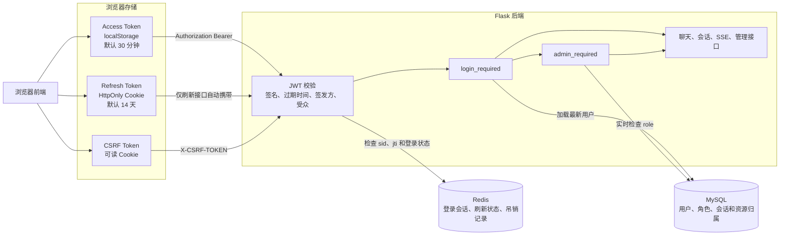
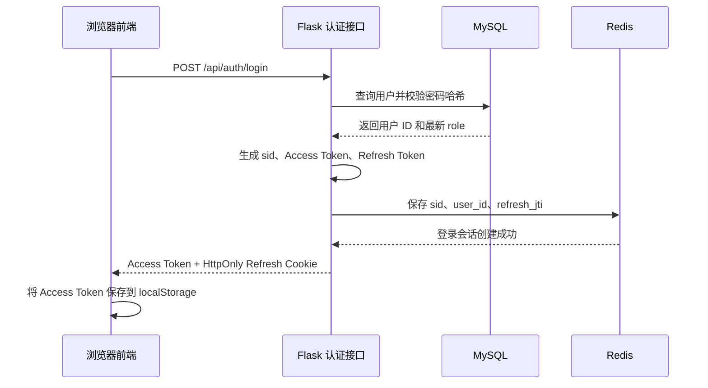
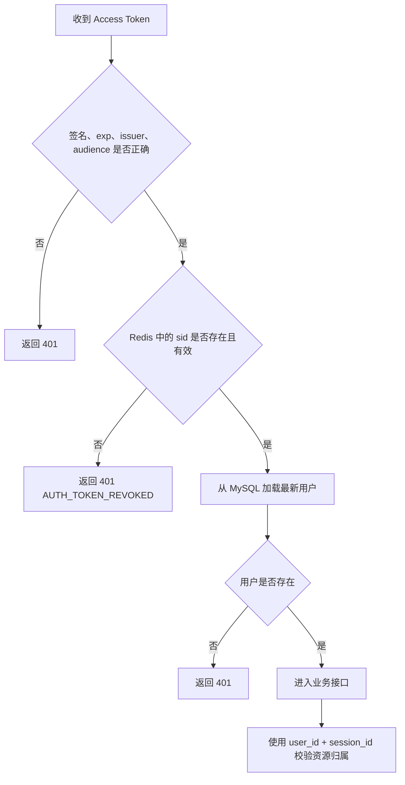
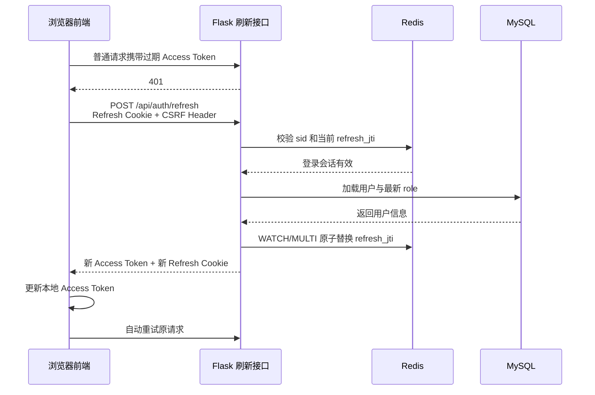
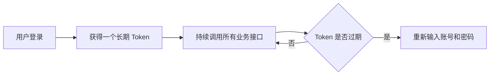
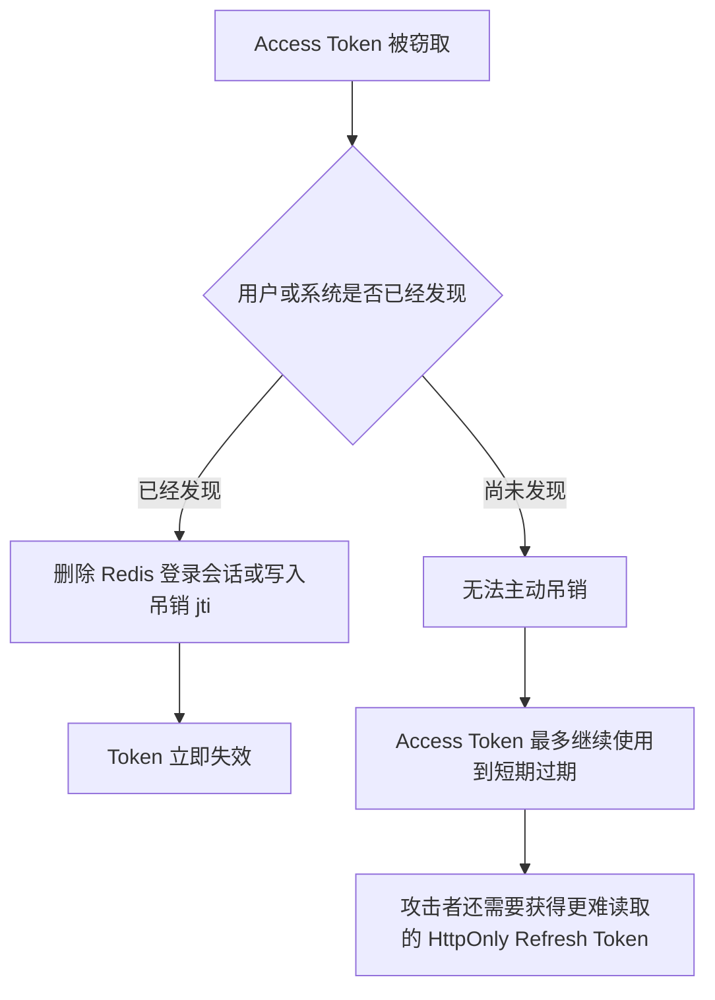
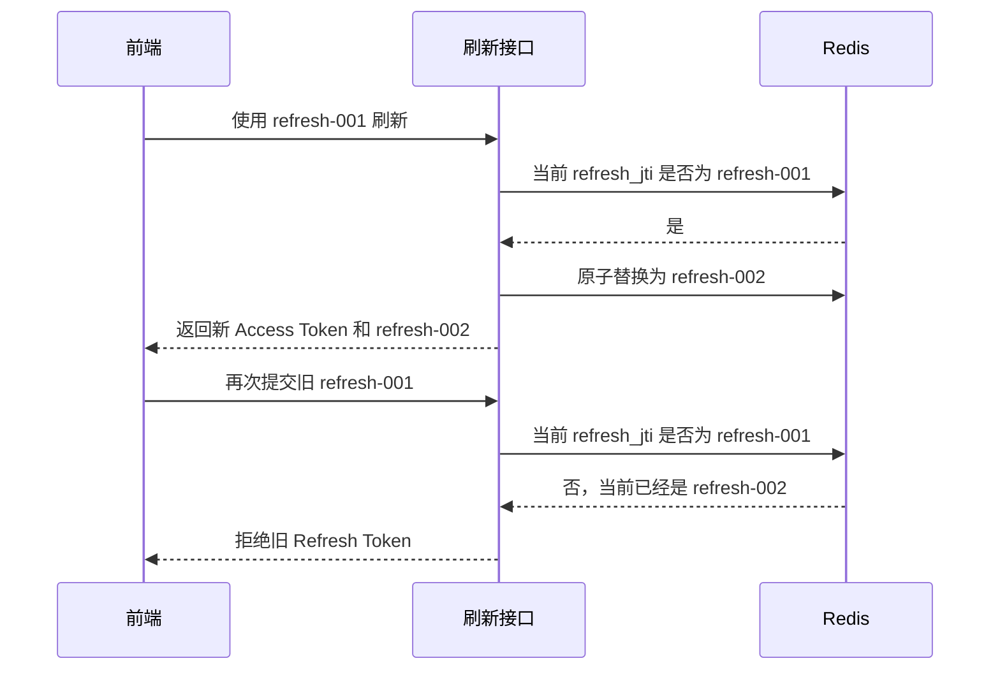
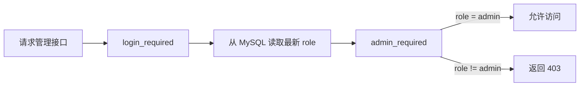
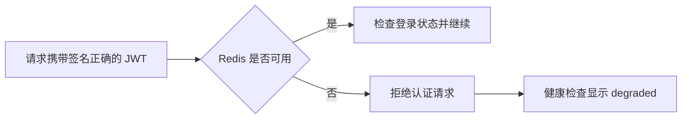

# 阶段 0.2：为 AI Agent 构建 JWT、Redis 与 MySQL 组合认证体系

随着项目从简单对话 Demo 逐渐演进为包含多轮会话、SSE 流式输出、RAG 管理和多 Agent 协作的平台，最初的“登录成功后签发一个长期 JWT”已经无法满足安全和管理需求。

本阶段将认证方案升级为：

> JWT 负责身份凭证，Redis 负责登录状态和吊销，MySQL 负责用户、权限与资源归属。

它并不是完全无状态的 JWT，也不是传统的服务端 Session，而是一套兼顾调用效率和可控性的混合认证方案。

## 一、为什么需要升级原有 JWT 方案

原来的方案虽然简单，但存在几个明显问题：

1. Access Token 有效期较长，签发后无法主动失效。
2. 用户退出登录时，前端只能删除本地 Token，服务端无法真正吊销。
3. 用户修改密码、被禁用或被降权后，旧 Token 仍可能继续使用。
4. 无法实现“退出当前设备”和“退出所有设备”。
5. 浏览器原生 EventSource 不能设置 Authorization 请求头，SSE 接口难以统一鉴权。
6. 如果直接把管理员角色写入 JWT，角色变更要等 Token 过期后才能生效。

因此，本阶段没有继续扩展手写 PyJWT 逻辑，而是引入 Flask-JWT-Extended，并使用 Redis 为 JWT 增加可控的服务端状态。

## 二、整体架构



三个存储层的职责边界如下：

| 数据 | 存储位置 | 用途 |
|---|---|---|
| Access Token | 浏览器 localStorage | 调用普通接口与 SSE |
| Refresh Token | HttpOnly Cookie | Access Token 过期后续签 |
| CSRF Token | 浏览器可读 Cookie | 防止刷新接口被跨站请求利用 |
| 登录会话 sid | Redis | 标识一次设备登录 |
| Refresh Token jti | Redis | 防止旧 Refresh Token 重放 |
| Access Token 吊销 jti | Redis | 让 Token 在到期前立即失效 |
| 用户、密码哈希、role | MySQL | 用户身份和管理员权限 |
| 会话、消息、摘要 | MySQL | 业务数据和资源归属 |

### 先理解几个常见术语

可以把整个认证系统类比为进入一栋需要登记的办公楼：

| 术语 | 类比 | 在系统中的含义 |
|---|---|---|
| Access Token | 临时门票 | 携带它调用聊天、会话、SSE 等业务接口 |
| Refresh Token | 续票凭证 | Access Token 过期后，用它换取一组新 Token |
| `jti` | 门票唯一编号 | 每一个 JWT 的唯一 ID，用于精确识别、轮换和吊销 |
| `sid` | 本次进楼登记编号 | 标识一次设备登录，同一用户不同设备拥有不同 sid |
| `exp` | 门票截止时间 | JWT 在什么时间失效 |
| `iat` | 门票签发时间 | JWT 是在什么时间生成的 |
| `role` | 人员身份 | 普通用户或管理员，由 MySQL 保存最新值 |

Access Token 和 Refresh Token 都是 JWT，但用途不同。Access Token 能直接访问业务接口，因此有效期较短；Refresh Token 不能直接访问业务接口，只能调用刷新接口，因此可以承担保持长期登录的职责。

`jti` 是 JWT ID。即使两个 Token 属于同一个用户，它们也会拥有不同的 `jti`：

```text
Access Token A
jti = access-001

Refresh Token A
jti = refresh-001

刷新后生成 Refresh Token B
jti = refresh-002
```

Redis 可以利用 `jti` 精确表示“哪一个 Token 已经被吊销”，而不需要更换 JWT Secret 让所有用户一起退出。

`sid` 则表示一次登录。例如同一个用户分别在电脑、手机和平板登录：

```text
电脑 Chrome  -> sid = login-a
手机浏览器    -> sid = login-b
平板          -> sid = login-c
```

每次登录签发的 Access Token 和 Refresh Token 会携带相同的 `sid`，说明它们属于哪个设备会话。这样才能实现“只退出当前设备”和“退出所有设备”两种不同操作。

## 三、登录流程



登录时会为当前设备生成一个独立的 `sid`。同一用户在手机、电脑和其他浏览器登录时，每次都会生成不同的 `sid`，从而具备设备级会话管理能力。

Redis 不保存完整 JWT，只保存认证状态：

```text
auth:session:{sid}
├── user_id
├── refresh_jti
└── status = active

auth:user_sessions:{user_id}
└── sid-1, sid-2, sid-3 ...

auth:revoked:{jti}
└── 1
```

这样既减少了 Redis 中的敏感数据，也避免把 JWT 变成完全依赖数据库查询的普通 Session ID。

## 四、普通请求如何完成认证

前端调用普通接口时，将 Access Token 放入请求头：

```http
Authorization: Bearer <access-token>
```

后端处理顺序如下：



`login_required` 不只是解码 Token，还会完成两件重要工作：

1. 检查 Redis 中对应登录会话是否仍然有效。
2. 根据 JWT 中的用户 ID，从 MySQL 重新读取最新用户状态。

因此，删除用户、修改角色或者吊销登录会话都可以立即生效。

## 五、Access Token 自动续签

Access Token 默认只有 30 分钟有效期。过期后，前端不会立即要求用户重新登录，而是使用 Refresh Token 进行续签。



Refresh Token 使用一次后立即轮换。Redis 只认可当前登录会话中最新的 `refresh_jti`，旧 Refresh Token 再次出现时会被拒绝。

前端还对并发续签做了合并处理：多个接口同时返回 401 时，只发起一次刷新请求，其他请求等待刷新结果，避免多个 Refresh Token 轮换请求互相冲突。

### 为什么不直接使用一个长期 Token

直接签发一个有效期很长的 Token，在过期后要求用户重新登录，技术上完全可行，而且实现更加简单：



这种方式适合个人 Demo、低风险内部工具或不要求长期登录的系统，但它把两个职责放在了同一个 Token 中：

1. 调用所有业务接口。
2. 保持用户长期登录。

如果把这个 Token 设置为 14 天，它一旦被窃取，攻击者也可能在较长时间内直接调用聊天、会话甚至管理员接口。

Access Token 与 Refresh Token 分离后，职责变为：

```text
Access Token
├── 可以调用业务接口
├── 会接触前端 JavaScript
└── 默认只存活 30 分钟

Refresh Token
├── 不能调用普通业务接口
├── 只能访问刷新接口
├── 保存在 HttpOnly Cookie
└── 默认用于维持 14 天登录状态
```

两种方案的区别如下：

| 对比项 | 单个长期 Token | 短 Access Token + Refresh Token |
|---|---|---|
| 实现复杂度 | 低 | 较高 |
| 用户登录频率 | 低 | 低 |
| 直接调用业务接口的 Token 被盗后可用时间 | 可能数天 | 默认最多 30 分钟 |
| 自动续签 | 不需要 | 支持 |
| Refresh 重放检测 | 不支持 | 支持 |
| 单设备和全部设备退出 | 需要额外设计 | 当前方案已支持 |
| 适合简单 Demo | 是 | 可能偏重 |
| 适合管理员、RAG 和正式用户系统 | 风险较高 | 更合适 |

Refresh Token 存在的核心意义是解决一个矛盾：

> 既希望用户很久不用重新输入密码，又不希望一个能够直接调用业务接口的 Token 长时间有效。

### Redis 已经可以吊销，为什么 Access Token 还要短期

Redis 吊销和短期 Access Token 解决的是两个不同问题：

- Redis 解决“已经发现风险后，如何让 Token 立即失效”。
- 短期 Access Token 解决“尚未发现 Token 被盗时，如何限制损失时间”。
- Refresh Token 解决“Access Token 很短，但用户不应该频繁重新登录”。



因此，当前组合不是重复建设，而是三层互补：

```text
短期 Access Token：限制未发现泄露时的暴露窗口
Redis 登录状态：支持发现问题后的立即吊销
Refresh Token：在短 Access Token 下保持良好登录体验
```

### `jti` 如何防止 Refresh Token 重放

Refresh Token 每使用一次就会轮换。假设 Redis 当前记录的是 `refresh-001`：



Redis 只保存最新 `refresh_jti`，不保存完整 Refresh Token。原子替换使用 WATCH/MULTI，避免两个并发刷新请求同时成功。

## 六、为什么 Refresh Token 使用 HttpOnly Cookie

Refresh Token 的有效期比 Access Token 长，一旦泄露，攻击者能够持续换取新的 Access Token。因此它没有交给 JavaScript 管理，而是由浏览器保存到 HttpOnly Cookie。

当前 Cookie 策略包括：

- `HttpOnly`：前端 JavaScript 无法读取 Refresh Token。
- `Secure`：生产环境只通过 HTTPS 发送。
- `SameSite=Lax`：降低跨站请求风险。
- 限制 Cookie Path：Refresh Token 只发送到认证相关接口。
- CSRF 双提交校验：刷新请求必须同时携带 CSRF Cookie 和 `X-CSRF-TOKEN` 请求头。

Access Token 目前仍保存在 localStorage，以兼容现有 Bearer Token 和 SSE 调用方式。后续完善 CSP、Markdown 清洗和前端 XSS 防护后，可以进一步评估改为仅保存在内存中。

## 七、退出当前设备与退出所有设备

### 退出当前设备

调用：

```http
DELETE /api/auth/logout
```

后端会：

1. 将当前 Access Token 的 `jti` 写入 Redis 吊销集合。
2. 删除当前设备对应的 `sid` 登录会话。
3. 从用户登录会话集合中移除该 `sid`。
4. 清除 Refresh Cookie。

由于后续请求都必须在 Redis 中找到有效 `sid`，该设备已经签发但尚未过期的 Access Token 也会立即失效。

### 退出所有设备

调用：

```http
DELETE /api/auth/logout-all
```

后端通过 `auth:user_sessions:{user_id}` 找到用户的所有登录 `sid` 并统一删除。手机、电脑以及其他浏览器中的登录状态都会失效。

吊销记录设置了与 JWT 剩余有效期一致的 TTL。Token 自然过期后，Redis 会自动删除对应记录，避免吊销集合无限增长。

## 八、管理员权限为什么不直接写进 JWT

项目为后续 RAG 管理系统增加了轻量的 `admin_required` 权限控制。



管理员角色保存在 MySQL，而不是作为可信权限长期写入 JWT。这样可以获得以下效果：

- 普通用户升级为管理员后，不需要重新登录。
- 管理员被降权后，旧 Access Token 也无法继续访问管理接口。
- 删除或停用用户后，其现有 Token 会立即失去业务访问能力。
- 前端的 `role` 只用于显示菜单和入口，不构成真正的权限边界。

项目还提供环境变量驱动的管理员邀请码：注册时可以选择填写，普通用户登录后也可以兑换。邀请码本身属于管理员凭据，不应写入代码、Git、JWT、数据库或日志。

后端管理接口必须显式使用：

```python
@admin_required
def manage_rag():
    ...
```

即使前端隐藏了管理页面，也不能省略后端权限校验。

## 九、会话资源归属校验

完成登录认证并不代表用户可以操作任意业务资源。

原来的部分接口只根据 `session_id` 查询、重命名或删除会话。如果攻击者获得了其他用户的 `session_id`，就可能发生越权访问。

本阶段将查询条件统一改为：

```sql
WHERE user_id = %s AND session_id = %s
```

覆盖范围包括：

- 会话读取、重命名和删除。
- 历史消息读取和写入。
- 最近消息与消息数量统计。
- 对话摘要读取和更新。
- Love Master 与 Manus 两个 SSE 聊天入口。

访问不属于当前用户的 `session_id` 时，对外统一返回资源不存在，避免额外泄露资源是否真实存在。

## 十、SSE 如何携带 JWT

浏览器原生 EventSource 无法自定义 Authorization 请求头，因此不能直接沿用普通 Bearer Token 认证。

本阶段将 SSE 客户端改为：

```text
fetch + ReadableStream + Authorization Header
```

前端继续解析 `text/event-stream` 数据，并保留原有的 `onmessage`、`onerror` 和 `close` 调用形式。这样既维持了现有页面接口，又让 SSE 与普通请求进入同一套 `login_required` 认证链路。

当 SSE 首次收到 401 时，前端会尝试刷新 Access Token，然后重新建立一次流式请求。

## 十一、开发环境同源代理

本地开发时，Vite 端口可能因为被占用而从 3000 自动切换到 3001、3002 或其他端口。如果浏览器直接访问 `localhost:8123`，每次端口变化都需要同步修改后端 CORS 白名单。

当前开发环境统一使用相对地址：

```env
VITE_API_BASE_URL=/api
```

Vite 将 `/api` 代理到 Flask：

```text
浏览器 http://localhost:<vite-port>/api
              │
              └── Vite proxy
                    │
                    └── http://127.0.0.1:8123/api
```

浏览器看到的是同源请求，因此登录、注册、Refresh Cookie、普通接口和 SSE 不再受开发端口变化影响。

后端仍保留精确 `CORS_ORIGINS` 白名单，用于生产环境前后端确实部署在不同域名的场景。携带 Cookie 的请求不能使用 `Access-Control-Allow-Origin: *`。

## 十二、Redis 故障时如何处理

认证状态存放在 Redis 后，需要明确 Redis 不可用时的安全策略。

当前采用 `fail-closed`：



也就是说，Redis 故障时不会跳过吊销和登录会话检查。它牺牲了一部分可用性，但避免已经退出或被吊销的 Token 在故障期间重新获得访问能力。

生产环境中的 Redis 因而属于认证链路的必要基础设施，需要：

- 开启合理的持久化和备份。
- 限制网络访问，禁止直接暴露到公网。
- 设置连接超时和健康检查。
- 对内存、延迟、连接数和驱逐策略进行监控。

## 十三、主要配置

示例配置只提供格式，不应该包含任何真实秘密：

```env
# JWT
JWT_SECRET=replace-with-a-long-random-jwt-secret
JWT_ACCESS_TOKEN_MINUTES=30
JWT_REFRESH_TOKEN_DAYS=14
JWT_ISSUER=your-service-name
JWT_AUDIENCE=your-web-client

# Redis
REDIS_URL=redis://127.0.0.1:6379/0
REDIS_AUTH_PREFIX=your-app:auth
REDIS_CONNECT_TIMEOUT=2
REDIS_SOCKET_TIMEOUT=2

# Administrator bootstrap
ADMIN_INVITE_CODE=replace-with-a-long-random-admin-invite-code

# Direct cross-origin deployments only
CORS_ORIGINS=https://your-frontend.example.com
```

生产环境应使用足够长的随机 JWT Secret 和管理员邀请码，并通过部署平台的 Secret 管理能力注入，而不是提交到 Git。

## 十四、关键代码结构

```text
app/
├── extensions.py       # JWTManager 与 Redis 客户端
├── auth_store.py       # Redis 登录会话、轮换与吊销
├── auth.py             # 登录、刷新、退出和权限装饰器
├── config.py           # JWT、Redis、Cookie、CORS 配置
├── chat_history.py     # user_id + session_id 资源归属
└── routes/
    ├── session.py      # 会话接口鉴权
    ├── manus.py        # Agent SSE 鉴权
    └── love_app.py     # Chain SSE 鉴权
```

核心依赖：

```text
Flask-JWT-Extended==4.7.4
redis==8.1.0
```

## 十五、测试与验证

当前安全回归测试覆盖：

1. 缺少 Token 时返回统一 401 错误。
2. `admin_required` 使用数据库最新角色。
3. Refresh Token 能够轮换，旧登录会话可以被吊销。
4. 正确和错误邀请码产生预期的注册角色或错误。
5. 已登录用户可以兑换管理员邀请码。

同时验证了：

- 前端生产构建。
- Python 语法编译。
- Redis 连接和认证状态。
- 注册、登录、刷新、退出、会话和 SSE 接口可达性。
- 开发环境 Vite 同源代理。

## 十六、方案取舍与后续方向

当前方案的核心价值是：在保留 JWT 请求便利性的同时，获得服务端可控的登录状态。

它已经支持：

- 短期 Access Token。
- Refresh Token 自动轮换。
- 单设备退出和全部设备退出。
- Token 主动吊销。
- 管理员权限实时生效。
- SSE 统一鉴权。
- 会话资源归属校验。
- Redis 异常时安全拒绝。

仍然可以继续完善的方向包括：

1. 将 Access Token 从 localStorage 迁移到内存，进一步降低 XSS 窃取风险。
2. 增加登录、注册、刷新和邀请码兑换限流。
3. 将固定管理员邀请码升级为数据库邀请码，支持单次使用、过期、吊销和审计。
4. 增加密码修改后强制退出全部设备。
5. 增加管理员操作审计日志。
6. 使用 Flask-Migrate/Alembic 管理用户角色及后续权限表结构。
7. 为 Redis 增加生产级高可用、持久化和监控。

## 总结

这次改造将项目从“签发 JWT 后只能等待过期”的简单认证，升级为“JWT 凭证 + Redis 登录状态 + MySQL 实时权限”的组合体系。

JWT 让接口调用保持轻量，Redis 让登录状态可以被立即控制，MySQL 则保证用户角色和业务资源归属拥有唯一可信来源。三者各自承担清晰职责，共同为后续 RAG 管理、多 Agent 协作和更复杂的后台能力提供了稳定的认证基础。
