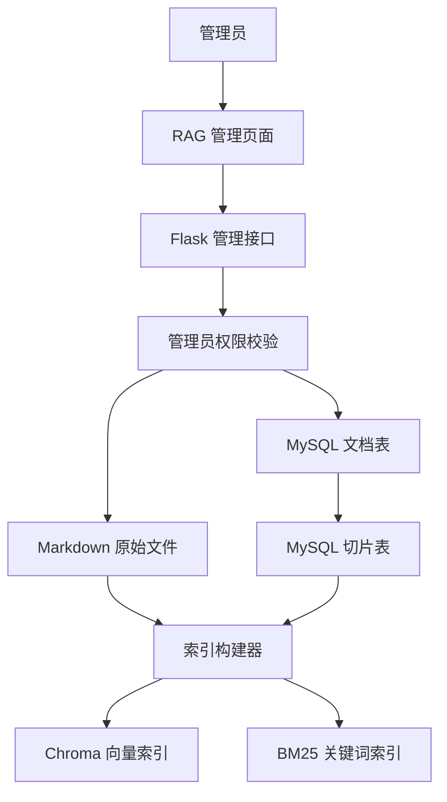
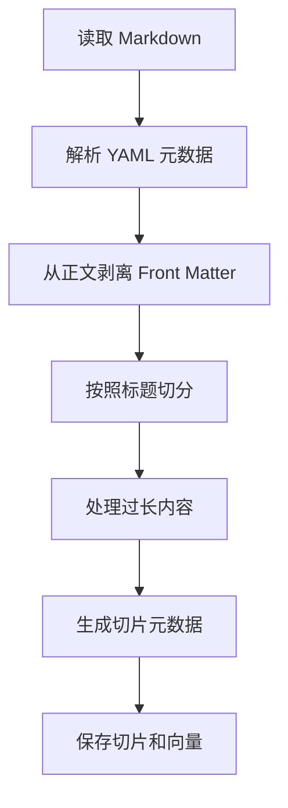
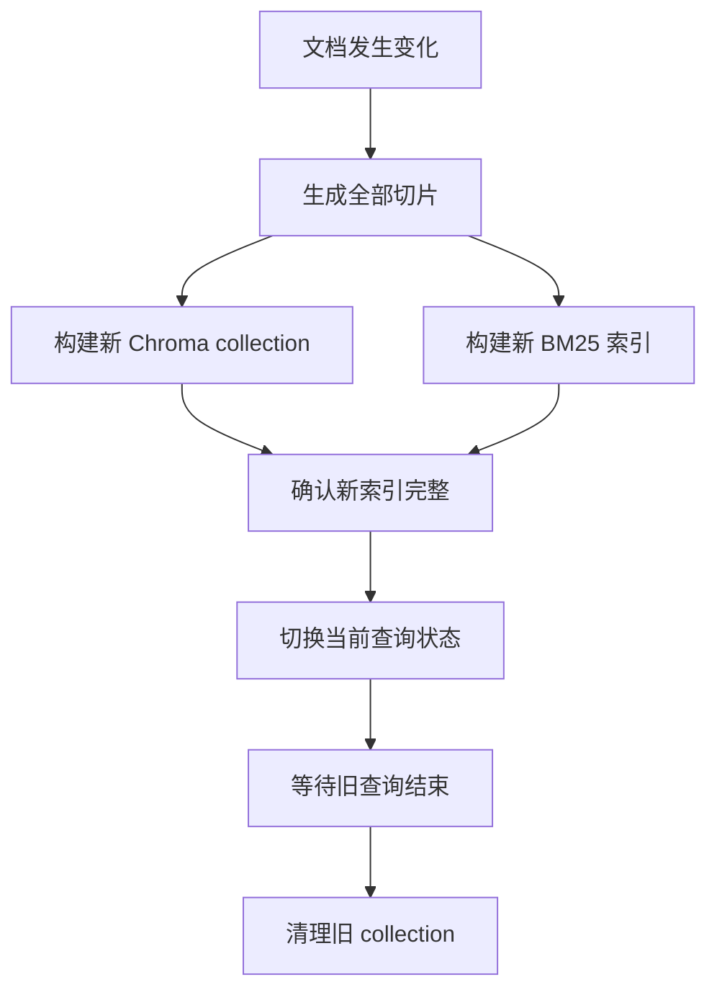
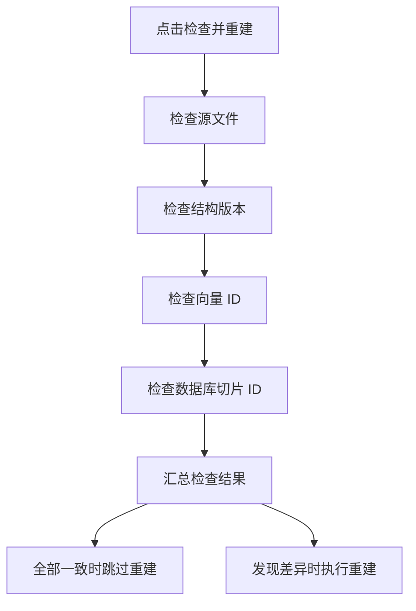
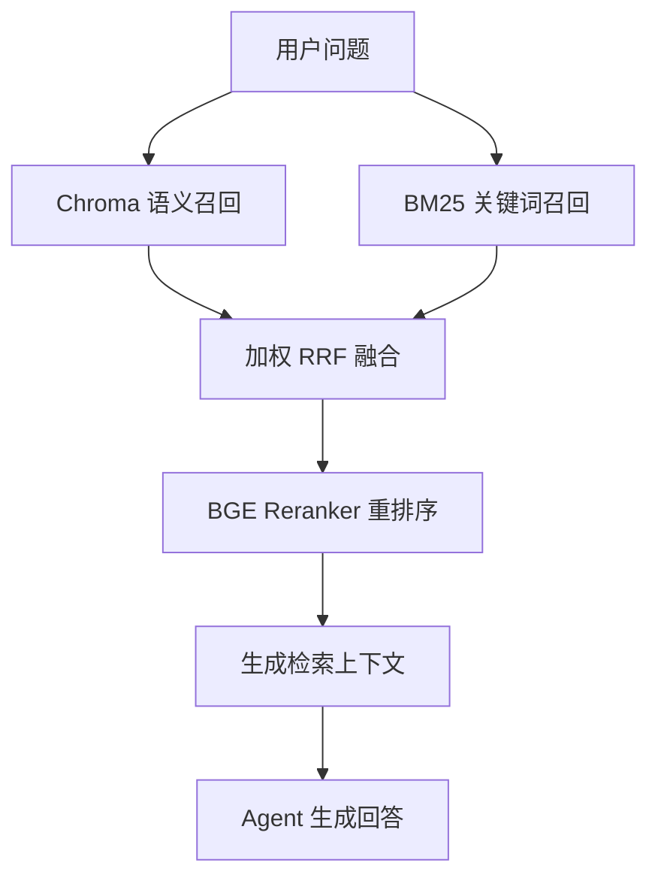

# 阶段 4.1：为 AI Agent 构建可管理、可追踪的 RAG 知识库

RAG 的第一版通常很简单：把若干文件放进目录，启动时生成向量，然后在用户提问时检索相关片段。

这种实现足以验证效果，但随着知识文档不断增加，新的问题会很快出现：

- 谁可以上传和删除知识文档？
- 文档现在是否已经进入向量库？
- 一个切片来自哪个文件和章节？
- 文件删除后，旧向量是否仍然存在？
- 索引构建失败时，线上查询是否会一起失效？
- 每次点击重建，是否都要重新计算全部向量？
- 页面长时间没有响应时，用户如何判断系统是否还在工作？

因此，本阶段的目标不是简单增加一个上传按钮，而是让 RAG 从“代码中的检索函数”演进为一个具备权限边界、数据模型、索引生命周期和管理界面的知识库系统。

## 一、本阶段实现了什么

本次改造完成了以下闭环：

1. 管理员可以从首页进入独立的 RAG 管理页面。
2. 普通用户看不到入口，也无法绕过前端调用管理接口。
3. 管理员可以查看文档元数据、Markdown 全文和实际切片。
4. 管理员可以上传和删除 Markdown 文件。
5. 文档变化后自动刷新 Chroma 和 BM25。
6. 文档与切片分别保存到 MySQL 两张表。
7. MySQL 切片 ID 与 Chroma 向量 ID 一一对应。
8. 新索引成功后才切换，失败时恢复文件和旧索引。
9. 手动重建前先检查一致性，最新索引不会重复构建。
10. 前端提供格式示例、示例文件下载和分阶段进度。

## 二、整体架构



这套架构中不存在一个存储承担所有职责：

| 存储 | 主要职责 |
|---|---|
| Markdown 文件 | 保存用户上传的原始内容 |
| MySQL 文档表 | 保存文件台账和文档元数据 |
| MySQL 切片表 | 保存切片正文和可审计元数据 |
| Chroma | 保存向量和在线语义检索数据 |
| BM25 | 提供关键词召回 |

原始文件是内容来源，MySQL 是管理事实，Chroma 和 BM25 是可以根据前两者重新生成的检索索引。

## 三、为什么管理接口必须再次校验管理员权限

前端根据当前用户的 `role` 决定是否展示 `SYSTEM 003` 入口。这可以减少普通用户看到无关功能，但不能构成真正的安全边界。

用户完全可以绕过页面，直接向后端发送 HTTP 请求。因此，文档列表、全文、切片、上传、删除、索引状态和重建接口全部使用 `admin_required`。

后端鉴权时会根据 JWT 中的用户 ID 重新读取 MySQL 中的最新角色。管理员被降级后，即使旧 Token 尚未过期，也不能继续调用管理接口。

权限原则可以概括为：

> 前端隐藏入口负责使用体验，后端实时鉴权负责真正安全。

## 四、统一 Markdown 文档格式

知识文档限定为 UTF-8 编码的 `.md` 文件。文件由 YAML Front Matter 和 Markdown 正文两部分组成：

```markdown
---
schema_version: 1
title: 恋爱常见问题 - 暧昧篇
description: 面向暧昧阶段用户的关系确认与沟通指南。
status: 暧昧中
relationship_stage: situationship
category: 情感解惑
topics:
  - 关系确认
  - 沟通表达
audience:
  - 处于暧昧关系中的用户
language: zh-CN
version: "1.0"
source_type: curated
---

# 暧昧篇：在不确定中看清关系

## 1. 对方主动聊天代表喜欢我吗？

> 关键词：主动联系、关系判断

这里填写完整的问题分析和建议。
```

元数据包含标题、简介、关系阶段、分类、主题、适用人群、语言、版本和来源类型。`schema_version` 用来支持未来的格式演进。

前端“格式示例”窗口会说明编码、扩展名、Front Matter 和标题层级要求，并提供可直接下载修改的 `示例.md`。

## 五、Front Matter 不能成为正文切片

早期实现虽然解析了 Front Matter，却仍然把完整原文交给 Markdown 切分器。这会产生一个只有 `title`、`status` 和 `category` 的无效切片。

正确流程是：



本阶段改为使用安全 YAML 解析器，一次返回文档元数据和纯正文。只有纯正文参与标题切分、Embedding 和 BM25。

修复后，每篇内置文档由原来的六个切片变成五个有效问题切片，多余的元数据切片彻底消失。

## 六、文档表和切片表为什么要分开

文档与切片是一对多关系。如果把全部切片塞进文档表的 JSON 字段，会遇到几个问题：

- 查询某个切片必须读取和解析整个 JSON。
- 无法为单个切片建立唯一约束和索引。
- 难以进行增量更新和变化比较。
- 切片正文、元数据和向量 ID 不容易独立追踪。
- JSON 副本和真实切片表并存时会产生双倍维护成本。

因此，当前使用两张表。

### 文档表

`rag_documents` 保存：

- 文件名和展示名。
- 文件大小和文件 SHA-256。
- 文档级 JSON 元数据。
- 切片数量汇总。
- 索引状态和错误摘要。
- 上传人和时间。

`chunk_count` 只是列表页使用的轻量汇总，不保存切片内容。

### 切片表

`rag_document_chunks` 保存：

- 所属 `document_id`。
- 稳定 `chunk_id`。
- 文档内顺序 `chunk_index`。
- 切片正文 `content`。
- 内容指纹 `content_sha256`。
- 字符数和章节标题。
- 完整 JSON 元数据。
- Chroma 对应的 `vector_id`。

删除文档时，数据库通过外键级联删除切片。早期使用过的 `rag_documents.chunk_metadata` 已经删除，切片表成为唯一关系型数据源。

## 七、让 MySQL 切片与 Chroma 向量一一对应

每个切片都会生成稳定 `chunk_id`。该 ID 综合来源文件、切片位置和内容指纹，用来识别当前切片版本。

写入 Chroma 时，不再由向量库随机生成 ID，而是直接使用同一个 `chunk_id`：

```text
MySQL chunk_id
    等于
MySQL vector_id
    等于
Chroma vector_id
```

这样可以从管理页面的一条切片追踪到 Chroma 中的向量记录，也能在一致性检查时直接比较两侧 ID 集合。

切片元数据包括：

- `source`
- `document_title`
- `section_title`
- `chunk_index`
- `chunk_id`
- `char_count`
- `content_sha256`
- 继承的文档业务元数据

## 八、索引为什么要先构建再切换

直接清空旧 collection 再重建存在明显风险：如果 Embedding 下载失败、磁盘异常或者进程中断，线上知识库会立刻变成不可用状态。

当前索引更新采用新旧版本切换思路：



构建过程中，已经开始的查询继续使用旧索引。只有 Chroma 和 BM25 都成功后，系统才原子替换当前查询状态。

如果上传或删除触发的索引构建失败，系统会回滚文件和数据库操作，并尽力恢复与原始文件一致的索引。

## 九、应用重启不应该重复生成向量

Chroma 已经持久化到磁盘，但如果应用每次启动都调用 `from_documents`，仍会浪费时间并可能产生重复数据。

当前通过索引清单记录：

- 索引结构版本。
- 当前 collection 名称。
- 所有源文件的内容签名。
- 最近构建时间。

应用重启时会重新计算源文件签名，并核对 collection 中的向量 ID。如果内容和结构没有变化，直接复用已有 collection，只恢复进程内 BM25，不重新计算 Embedding。

Reranker 使用 `BAAI/bge-reranker-base` 并采用懒加载。第一次实际 RAG 查询才加载模型；模型文件完整下载后会复用本机 Hugging Face 缓存，不会在每次查询时重新下载。

## 十、重建前先判断是否真的需要

无条件重建会重复执行耗时的 Embedding。当前“检查并重建”会核对：

1. 源文件内容签名。
2. 索引结构版本。
3. Chroma collection 是否存在。
4. Chroma 向量 ID 是否完整。
5. MySQL 切片 ID 是否与源文档一致。



前端显示 `CHECKING`、`READY`、`STALE`、`UNKNOWN` 和 `SYNCING` 状态。即使调用方绕过前端直接请求重建接口，后端也会再次检查。

## 十一、上传为什么需要阶段进度

上传一个 Markdown 文件本身通常很快，真正耗时的是后端切片、Embedding、Chroma 持久化和 BM25 重建。如果页面只显示一个不可变化的加载按钮，用户很难判断请求是否已经卡住。

当前页面把过程拆成：

```text
校验文件
上传文档
构建索引
刷新页面
处理完成
```

浏览器能够提供文件上传的真实比例，因此该阶段显示确定百分比。同步索引接口暂时不能返回每条向量的实时进度，所以索引阶段使用动态状态、具体说明和实际耗时，不展示虚假百分比。

如果未来将索引构建迁移为后台任务，可以继续通过轮询或 SSE 返回“已处理切片数”和“已生成向量数”。

## 十二、上传和删除安全

上传操作校验：

- 文件名不能包含路径穿越字符。
- 文件扩展名必须是 `.md`。
- 内容必须使用 UTF-8 编码。
- 文档不能为空并且必须包含正文。
- YAML Front Matter 必须合法。
- 文件大小不能超过配置限制。
- 同名文档返回冲突，不进行隐式覆盖。

删除时先把文件移动到临时名称，再尝试重建索引。只有索引刷新成功后才彻底删除文件；失败时把文件恢复到原位置。

## 十三、当前检索链路



向量检索和 BM25 各召回十条结果，动态权重 RRF 融合后保留五条，再通过 Cross Encoder 重排序返回前三条。

当前知识库规模不大，但保留 Reranker 能为相似情感问题提供更精确的最终排序，也为后续文档扩张保持一致的检索链路。

## 十四、验证结果

本阶段完成了以下验证：

- 前端生产构建通过。
- 后端认证和 RAG 回归测试通过。
- MySQL 文档表和切片表初始化通过。
- 文档删除的外键级联约束建立成功。
- Front Matter 不再进入正文切片。
- MySQL `chunk_id` 与 Chroma `vector_id` 完全一致。
- 索引最新时跳过重建。
- 源文件或索引不一致时触发重建。
- 文档上传失败时文件和数据库操作能够回滚。

## 十五、仍然需要继续完成的部分

当前版本解决了 RAG 管理闭环和单进程索引安全，仍有以下演进方向：

1. 从全量重建升级为受影响切片的增量更新。
2. 增加稳定 `source_id` 和正式文档版本表。
3. 为多 Worker 增加共享 `active_version`、分布式锁和刷新广播。
4. 把索引构建迁移到后台任务，提供真实进度和失败重试。
5. 为中文 BM25 引入更合适的分词器。
6. 增加引用来源、召回记录和离线评测集。
7. 增加 Reranker 预热、并发限制和资源监控。

本阶段最大的变化，是让 RAG 不再只是“把文档放进向量库”，而是拥有了清晰的数据归属、更新流程、失败边界和管理入口。知识库开始成为可以持续运营的系统组件，而不是一次性的演示数据。
