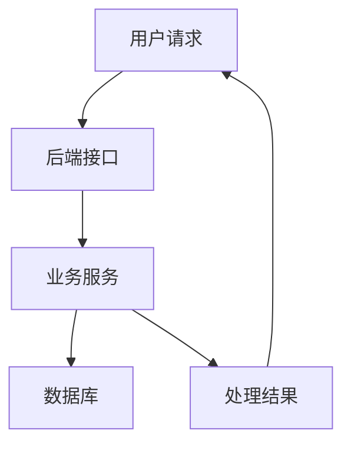
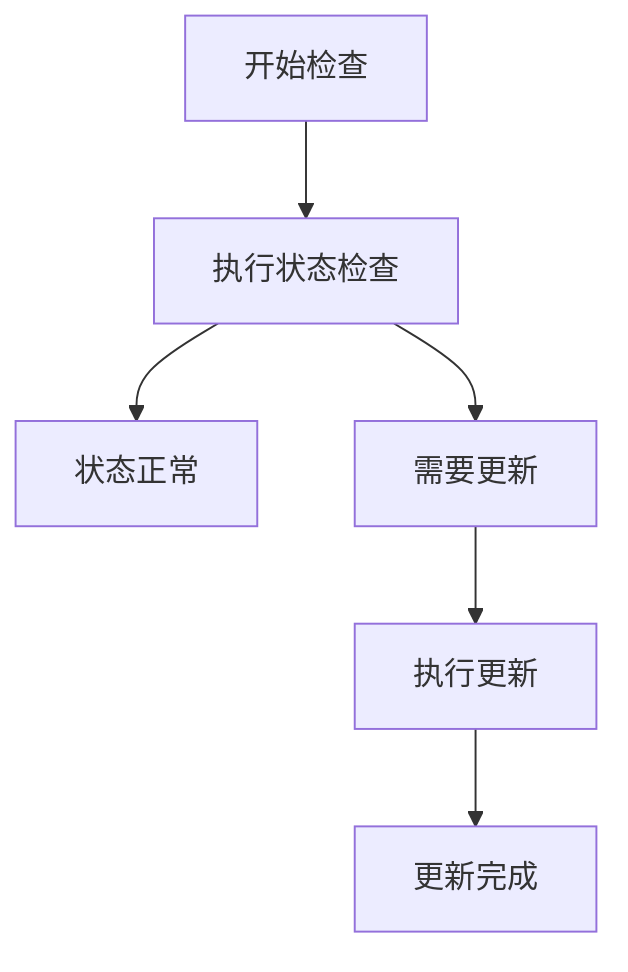

# 掘金 Mermaid 兼容规范

后续为掘金编写 Mermaid 图时，默认遵循本规范。

## 一、基础规则

- 统一使用 `flowchart TD`。
- 节点采用 `ID["节点文字"]`。
- 主要使用普通矩形节点和 `-->` 连线。
- 谨慎使用简单箭头标签。
- 避免 `subgraph`、`sequenceDiagram` 和特殊节点形状。
- 避免 `<br/>`、比较符、复杂标点及容易冲突的保留字。
- 控制单张图的节点数量和复杂度。
- 发布前检查代码块闭合及 Mermaid 语法。

当前 `docs/blogs` 中的图表格式可作为后续博客的标准模板。

## 二、推荐模板



## 三、分支流程模板



为了提高兼容性，优先通过节点文字表达分支含义，不依赖复杂的箭头标签和判断节点形状。

## 四、不推荐写法

以下语法在本项目的掘金博客中默认不使用：

```text
flowchart LR
subgraph Example
sequenceDiagram
NODE((圆形节点))
NODE{判断节点}
NODE[第一行<br/>第二行]
NODE -->|包含复杂符号的条件| TARGET
```

## 五、发布前检查清单

- Mermaid 代码块第一行是否为 `flowchart TD`。
- 节点是否统一使用 `ID["节点文字"]`。
- 是否只使用必要的普通箭头。
- 是否存在 `subgraph` 或 `sequenceDiagram`。
- 是否存在圆形、菱形或其他特殊节点。
- 是否使用 `<br/>` 或 HTML 标签。
- 节点文字是否包含比较符和复杂标点。
- 单张图节点是否过多。
- Mermaid 代码块是否正确闭合。
- 上传掘金后是否完成预览检查。
