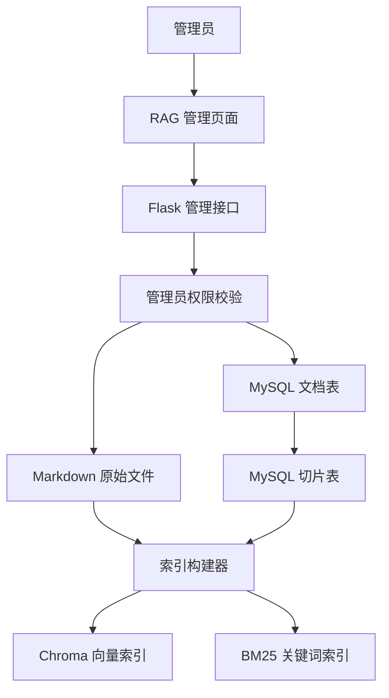
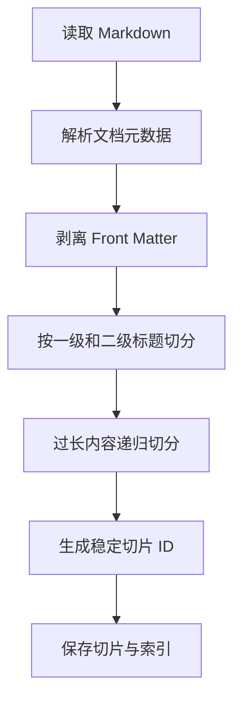
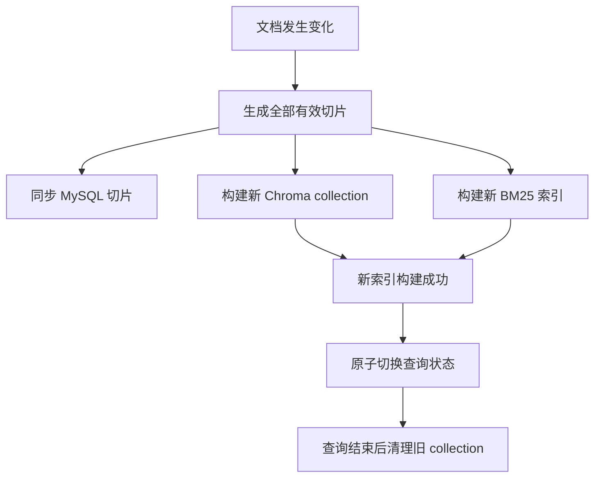
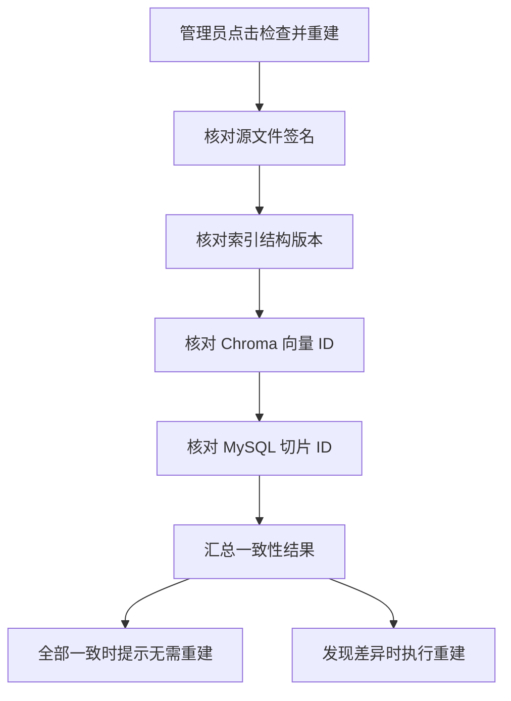
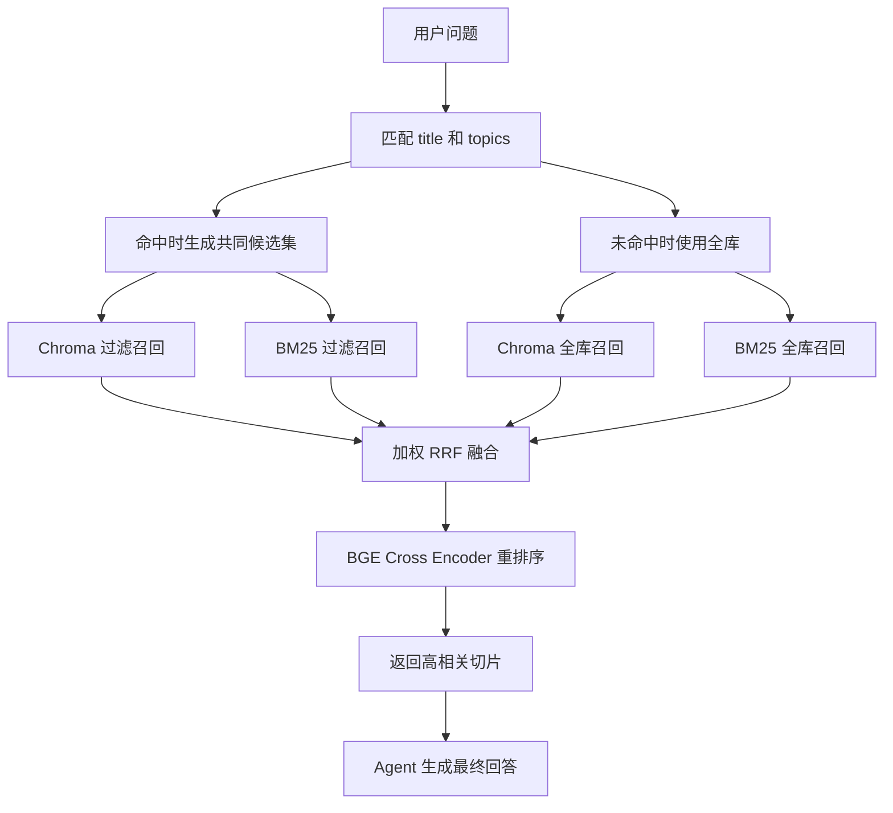

# RAG 检索与知识库管理

本文档记录 ZZX AI Agent 当前的 RAG 实现，包括 Markdown 文档规范、关系型数据模型、Chroma 与 BM25 索引、管理员管理接口、索引一致性检查和查询流程。

## 一、当前架构



各存储层职责如下：

| 存储 | 职责 |
|---|---|
| `documents/*.md` | 原始知识文档和 YAML Front Matter |
| `rag_documents` | 文档台账、文件哈希、文档元数据、状态和切片总数 |
| `rag_document_chunks` | 每条切片的正文、章节、哈希、元数据和向量 ID |
| Chroma | 切片向量、检索元数据和持久化 collection |
| BM25 | 进程内关键词索引 |
| 索引清单 | 当前 collection、源文件签名、结构版本和构建时间 |

原始文件是内容来源，MySQL 是管理和审计数据源，Chroma 与 BM25 是可重建的检索索引。

## 二、Markdown 文档规范

知识文档必须使用 UTF-8 编码和 `.md` 扩展名。顶部使用 YAML Front Matter，正文使用一级标题和二级问题标题。

```markdown
---
schema_version: 1
title: 恋爱常见问题 - 示例篇
description: 文档内容简介。
status: 示例状态
relationship_stage: example
category: 情感解惑
topics:
  - 主题一
  - 主题二
audience:
  - 适用人群
language: zh-CN
version: "1.0"
source_type: curated
---

# 示例篇：文档主标题

## 1. 第一个常见问题

> 关键词：关键词一、关键词二

这里填写完整的分析和建议。
```

Front Matter 使用 `yaml.safe_load` 解析，并与正文彻底分离。元数据不会形成独立切片，也不会进入正文向量化。

当前文档级元数据包括：

- `schema_version`：元数据结构版本。
- `title`：后台展示标题。
- `description`：内容简介。
- `status`：面向用户展示的关系状态。
- `relationship_stage`：标准化关系阶段。
- `category`：知识分类。
- `topics`：主题列表。
- `audience`：适用人群。
- `language`：内容语言。
- `version`：内容版本。
- `source_type`：来源类型。

## 三、文档与切片数据模型

### 3.1 文档表

`rag_documents` 一条记录代表一个 Markdown 文件，保存文件名、展示名、文件大小、SHA-256、文档元数据、切片数量、索引状态、上传用户和时间信息。

`chunk_count` 只用于列表快速统计，不保存切片内容。

### 3.2 切片表

`rag_document_chunks` 一条记录代表一个实际检索切片：

| 字段 | 说明 |
|---|---|
| `document_id` | 关联 `rag_documents.id` |
| `chunk_id` | 稳定的切片业务 ID |
| `chunk_index` | 文档内切片顺序 |
| `content` | 切片正文 |
| `content_sha256` | 切片正文指纹 |
| `char_count` | 正文字符数 |
| `section_title` | 所属二级标题 |
| `metadata` | 完整切片元数据 JSON |
| `vector_id` | 对应的 Chroma 向量记录 ID |

文档和切片是一对多关系。外键使用 `ON DELETE CASCADE`，删除文档记录时自动清理切片。

早期 MVP 使用过 `rag_documents.chunk_metadata` 保存 JSON 数组。该字段已经删除，切片表是唯一的关系型切片数据源。

## 四、切片策略



第一层使用 `MarkdownHeaderTextSplitter` 按一级、二级标题保持语义边界。第二层使用 `RecursiveCharacterTextSplitter` 处理超过 600 字符的内容，重叠长度为 50 字符。

每个切片包含：

- `source`
- `document_title`
- `section_title`
- `chunk_index`
- `chunk_id`
- `char_count`
- `content_sha256`
- 继承的文档业务元数据

`chunk_id` 根据来源文件、切片位置和内容指纹生成。MySQL 的 `chunk_id` 与 Chroma 的 `vector_id` 相同，能够直接追踪关系记录和向量记录。

## 五、索引构建与切换

上传或删除文档后，当前版本执行一次全量索引刷新：



索引更新不会直接覆盖当前 collection。系统先创建新的唯一 collection，向量和 BM25 都构建成功后，才替换进程内查询状态。

构建期间已经开始的查询继续使用旧索引。旧查询全部结束后，旧 collection 才会被清理。

索引清单 `rag_index_manifest.json` 保存索引结构版本、当前 collection、源文档内容签名和构建时间。

应用重启时，如果文档签名、结构版本和向量 ID 全部一致，会直接复用现有 collection，避免重复计算 Embedding。

## 六、检查并重建

管理员点击“检查并重建”时，系统不会无条件生成向量，而是检查：

1. 源文件内容签名。
2. 索引结构版本。
3. Chroma collection 是否存在。
4. Chroma 向量 ID 是否与当前切片一致。
5. MySQL 切片 ID 是否与源文档一致。



页面状态包括 `CHECKING`、`READY`、`STALE`、`UNKNOWN` 和 `SYNCING`。后端重建接口也会再次检查，防止绕过前端造成无意义重建。

## 七、检索流程



| 阶段 | 数量或策略 |
|---|---|
| 向量召回 | Top 10 |
| BM25 召回 | Top 10 |
| RRF 融合 | Top 5 |
| Cross Encoder 重排序 | Top 3 |

短查询提高 BM25 权重，长查询提高向量检索权重。Reranker 使用 `BAAI/bge-reranker-base`，首次查询时懒加载，模型下载完成后复用本机缓存和进程内实例。

### 7.1 title 和 topics 元数据软过滤

在线查询在正式召回前，对用户问题与文档的 `title`、`topics` 和兼容字段 `topic` 做一次轻量匹配：

1. 统一大小写并去除空格、标点等非语义字符。
2. 标题去除“恋爱常见问题”“篇”等通用部分，保留具有区分度的标题词。
3. `topics` 同时支持原生列表和写入 Chroma 后的 JSON 字符串形式。
4. 明确命中时，以源文档为单位选出全部候选切片。
5. Chroma 使用相同 `source` 集合执行元数据过滤后的向量召回。
6. BM25 仅使用同一批候选切片执行关键词召回。
7. 没有任何明确命中时，两路都直接使用全库索引。

这是一种保守的软过滤策略。元数据只决定候选范围，不直接参与向量相似度或 RRF 分数计算，也不会使用低置信度猜测强制排除文档。

| 查询情况 | Chroma | BM25 |
|---|---|---|
| `title/topics` 明确命中 | 在命中文档内向量检索 | 在相同切片集合内关键词检索 |
| 未命中 | 全库向量检索 | 全库关键词检索 |

两路召回的范围始终保持一致，随后再进入原有的动态权重 RRF 和 Cross Encoder 重排序。

## 八、管理员接口

全部接口使用 `admin_required`：

| 方法 | 路径 | 用途 |
|---|---|---|
| GET | `/api/admin/rag/documents` | 文档列表和统计 |
| GET | `/api/admin/rag/documents/{id}` | 文档元数据和正文 |
| GET | `/api/admin/rag/documents/{id}/chunks` | 从切片表读取详情 |
| POST | `/api/admin/rag/documents` | 上传 Markdown 并刷新索引 |
| DELETE | `/api/admin/rag/documents/{id}` | 删除文档并刷新索引 |
| GET | `/api/admin/rag/index-status` | 检查索引一致性 |
| POST | `/api/admin/rag/rebuild` | 必要时重建索引 |

普通用户即使绕过前端直接调用，也会得到统一的 403 响应。

## 九、上传与删除安全

上传校验包括安全文件名、`.md` 扩展名、UTF-8 编码、非空正文、合法 YAML Front Matter、文件大小限制和禁止隐式覆盖同名文档。

上传失败会删除临时文件和数据库记录，并尽力恢复原索引。删除时先把文件原子移动到临时名称，索引构建成功后才彻底删除；失败时恢复源文件。

## 十、前端管理体验

管理员首页显示 `SYSTEM 003` RAG 入口。管理页面支持：

- 文档目录和索引状态。
- 文档级元数据展示。
- Markdown 全文查看。
- 关系型切片详情。
- 全部切片元信息查看，并标明文档继承、标题提取和切片生成来源。
- Markdown 上传和删除。
- 格式说明与 `示例.md` 下载。
- 上传、切片、向量构建和刷新阶段提示。
- 智能检查并重建。

文件上传阶段显示浏览器能够提供的真实上传比例。后端同步构建阶段目前无法返回精确百分比，因此展示动态状态和实际耗时。

## 十一、当前边界与后续计划

当前版本适合单进程部署，仍有以下增强方向：

1. 文档变化后只更新受影响切片和向量。
2. 使用稳定 `source_id` 和正式文档版本。
3. 为多 Worker 增加共享 `active_version`、分布式锁和刷新广播。
4. 将索引构建改为后台任务，并返回真实切片和向量进度。
5. 为中文 BM25 引入更合适的分词器。
6. 增加引用展示、召回测试和离线质量评测。
7. 控制 Reranker 并发，并按部署环境选择预热或降级策略。

## 十二、主要实现文件

- `zzx-ai-agent-backend/app/llm/rag.py`
- `zzx-ai-agent-backend/app/rag_documents.py`
- `zzx-ai-agent-backend/app/routes/rag_admin.py`
- `zzx-ai-agent-backend/documents`
- `zzx-ai-agent-frontend/src/views/RagAdmin.vue`
- `zzx-ai-agent-frontend/src/api/index.js`
- `zzx-ai-agent-frontend/public/示例.md`
